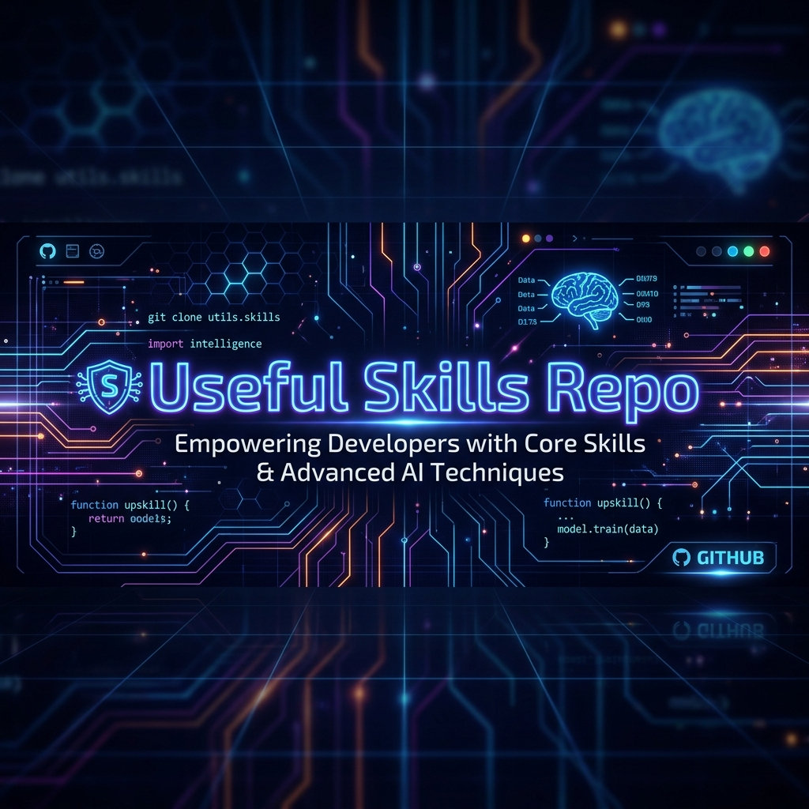

<div align="center">
  
  
  <h1>🧠 Useful Skills Repository</h1>
  <p><strong>A Premium Collection of Custom AI Skills & Workflows for Modern Development</strong></p>
  
  <p>
    <a href="https://github.com/MihirSoni2824/UsefulSkillsRepo/stargazers"></a>
    <a href="https://github.com/MihirSoni2824/UsefulSkillsRepo/network/members"></a>
    <a href="https://github.com/MihirSoni2824/UsefulSkillsRepo/blob/main/LICENSE"></a>
  </p>

  <p>
    <em>Empower your AI assistants with context, architecture rules, and deep technical knowledge.</em>
  </p>
</div>

---

## 🚀 Overview

Welcome to the **Useful Skills Repository**! This is a continually evolving, long-term library of practical, customized AI skills designed to supercharge day-to-day development work. 

> **Why this repo?** AI assistants are smart, but they lack project-specific context and architectural discipline. By injecting these "skills" into your AI workflow, you enforce strict rules, eliminate repetitive prompting, and guarantee high-quality code generation every time.

Whether you are using an AI assistant like **Cursor**, **GitHub Copilot**, **Antigravity (Gemini)**, or **Cline**, these skills provide:
- ✨ **Reusable Prompts**
- 🏗️ **Implementation Workflows**
- 🎨 **Frontend Patterns**
- ⚙️ **Engineering Rules & Specialized Guidance**

Instead of writing the same context and instructions repeatedly, each skill captures a focused way of working that can be instantly reused across any project. **I will be adding more skills to the `skills/` directory continuously as I discover new patterns and optimizations.**

---

## 🛠️ How to Integrate Skills

These skills can be injected into your favorite AI IDEs to provide them with specialized context and rules. You can apply them in two different scopes:

### 🌍 Global Scope vs 📂 Project-Wise Scope

- **Global Scope:** Add the skill instructions to your AI's global configuration. This means the AI will apply these rules and patterns across *all* projects you work on in that IDE. Perfect for general coding standards, ubiquitous UI patterns, or overarching engineering philosophies.
- **Project-Wise Scope:** Add the skill instructions only to a specific repository's configuration file (e.g., `.cursorrules`, local `skills/` folder, etc.). The AI will only use this skill when you are working inside that specific repository. Ideal for project-specific tech stacks or strict architectural rules.

### 🔌 Integration Guides for Major IDEs

<details>
<summary><strong>Cursor 💻</strong></summary>
<br>
1. **Global Scope:** Go to `Cursor Settings > General > Rules for AI` and paste the contents of the desired skill markdown file.<br>
2. **Project-Wise Scope:** Create a `.cursorrules` file at the root of your project repository and paste the skill's content there.
</details>

<details>
<summary><strong>GitHub Copilot (VS Code) 🐙</strong></summary>
<br>
1. **Project-Wise Scope:** Copilot allows custom instructions via a `.github/copilot-instructions.md` file in your repository. You can copy the contents of any skill into this file.
</details>

<details>
<summary><strong>Antigravity / Gemini IDE ✨</strong></summary>
<br>
1. **Global Scope:** Place the skill directory/file inside your global custom instructions directory (e.g., `~/.gemini/config/skills/`).<br>
2. **Project-Wise Scope:** Place the skill directory/file inside your project's local directory (e.g., `.agents/skills/`). <br>
*(Note: Ensure your skill follows the `SKILL.md` format with YAML frontmatter for automatic discovery).*
</details>

<details>
<summary><strong>Cline / Roo Code (VS Code Extension) 🤖</strong></summary>
<br>
1. **Project-Wise Scope:** Create a `.clinerules` or `.roomodes` file in the root of your project and paste the custom instructions and rules from the skill.
</details>

---

## 📂 Repository Structure

All custom skills are stored inside the `skills/` directory.

```text
UsefulSkillsRepo/
├── assets/
│   └── banner.png               # Repo visual assets
├── skills/
│   ├── aave-liquid-glass.md     # Example skill
│   └── (More skills coming soon...)
├── CONTRIBUTING.md
└── README.md
```

---

## 📚 Available Skills

*This section will be updated as new skills are introduced.*

| Skill Name | Description |
| :--- | :--- |
| 🔮 [`aave-liquid-glass.md`](skills/aave-liquid-glass.md) | Comprehensive guidance for building advanced Liquid Glass UI effects with realistic refraction, depth, motion, accessibility, and browser-aware implementation rules. |

---

## 🤝 Contributing & Adding New Skills

Contributions are incredibly welcome! The goal is to build a massive library of reusable AI skills.

For full details on how to contribute, the expected skill structure, and formatting guidelines, please read the [**CONTRIBUTING.md**](CONTRIBUTING.md) guide.

If you have a quick skill you'd like to share:

1. Create a new Markdown file inside the `skills/` directory (e.g., `nextjs-workflows.md`).
2. Start with a clear title and a short context section explaining when to use it.
3. Provide actionable rules, workflows, constraints, and validation checklists.
4. Keep the skill focused on one repeatable development need.

---

## ❤️ Support & Funding

If these skills have helped you write better code, save time, or build beautiful UIs, please consider supporting the future development and maintenance of this repository! 

Your support helps me maintain these skills, research new patterns, and keep this project growing.

<div align="center">
  
[](https://buymeacoffee.com/mihirsoni2824)

<br><br>

[](https://github.com/sponsors/MihirSoni2824)

*Thank you for your support!*
</div>

---

## 📜 License

This repository is licensed under the [MIT License](LICENSE).
